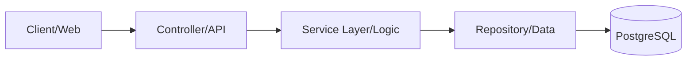

# HRMS Lite - Human Resource Management System

A high-performance, full-stack HRMS solution designed for speed, scalability, and developer experience. Built with a modern **FastAPI** backend and a reactive **Vite + React** frontend.

FRONTEND -- https://new-hrms-one.vercel.app/
BACKEND -- https://hrms-backend-pyz3.onrender.com

---

## 🚀 Core Features

### 👥 Talent Lifecycle Management
- **Smart Onboarding**: Add employees with real-time field validation.
- **Dynamic Search**: Instant filtering by ID, Email, Department, or Name.
- **Data Integrity**: Intelligent prevention of duplicate Employee IDs and Emails.

### 📅 Workforce Presence Tracking
- **One-Click Attendance**: Streamlined "Present/Absent" logging.
- **History Logs**: Interactive table view of all historical attendance.
- **Smart Constraints**: Prevents double-marking attendance for the same day.

### 📊 Executive Dashboard
- **Live Stats**: Real-time counter for total workforce.
- **Presence Ratio**: Instant summary of today's attendance metrics.

---

## 🏗️ Technical Architecture

This project follows a strict **Layered MVC Architecture** to ensure maintenance and testability.

### The Request Flow (The "ABCD" Pattern)


- **Models**: Defines SQLAlchemy entities for the database.
- **Schemas**: Pydantic models for strict API request/response validation.
- **Repositories**: Isolated data access layer for clean CRUD operations.
- **Services**: The "Brain" of the app – handles business rules and validations.

---

## 🛠️ Technology Stack

| Layer | Technology | Key Role |
|-------|------------|----------|
| **Frontend** | React 18 / Vite | Modern, blazing-fast reactive UI |
| **Backend** | FastAPI | High-performance, async Python framework |
| **ORM** | SQLAlchemy | Professional-grade Database Mapping |
| **Validation** | Pydantic | Type-safe data contracts |
| **Database** | PostgreSQL | Robust Relational Data Storage |

---

## 🚦 Quick Start

### Prerequisites
- Node.js 18+
- Python 3.9+ 
- PostgreSQL 12+

### 1. Clone & Initialize
```bash
git clone <your-repo-url>
cd new-hrms-main
```

### 2. Backend Setup
```bash
cd backend
python -m venv venv
venv\Scripts\activate  # Windows
pip install -r requirements.txt
uvicorn app.main:app --reload
```

### 3. Frontend Setup
```bash
cd frontend
npm install
npm run dev
```

---

## 📖 Project Documentation

- [ARCHITECTURE.md](./ARCHITECTURE.md) - Deep dive into design patterns and code structure.
- [QUICK_START.md](./QUICK_START.md) - Simple 5-minute setup guide.
- [POSTGRES_SETUP.md](./POSTGRES_SETUP.md) - Database installation help.

---

## 📡 Key API Endpoints

- `GET /api/employees` - List all workforce members.
- `POST /api/employees` - Onboard a new employee.
- `POST /api/attendance` - Log workforce presence.

---

**Built with passion for clean code and modern architecture. 🚀**
